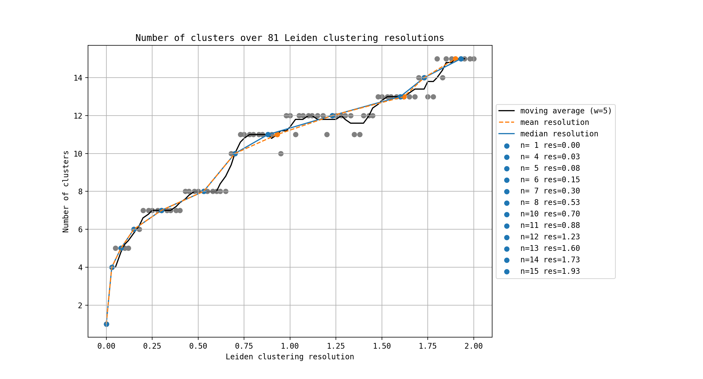
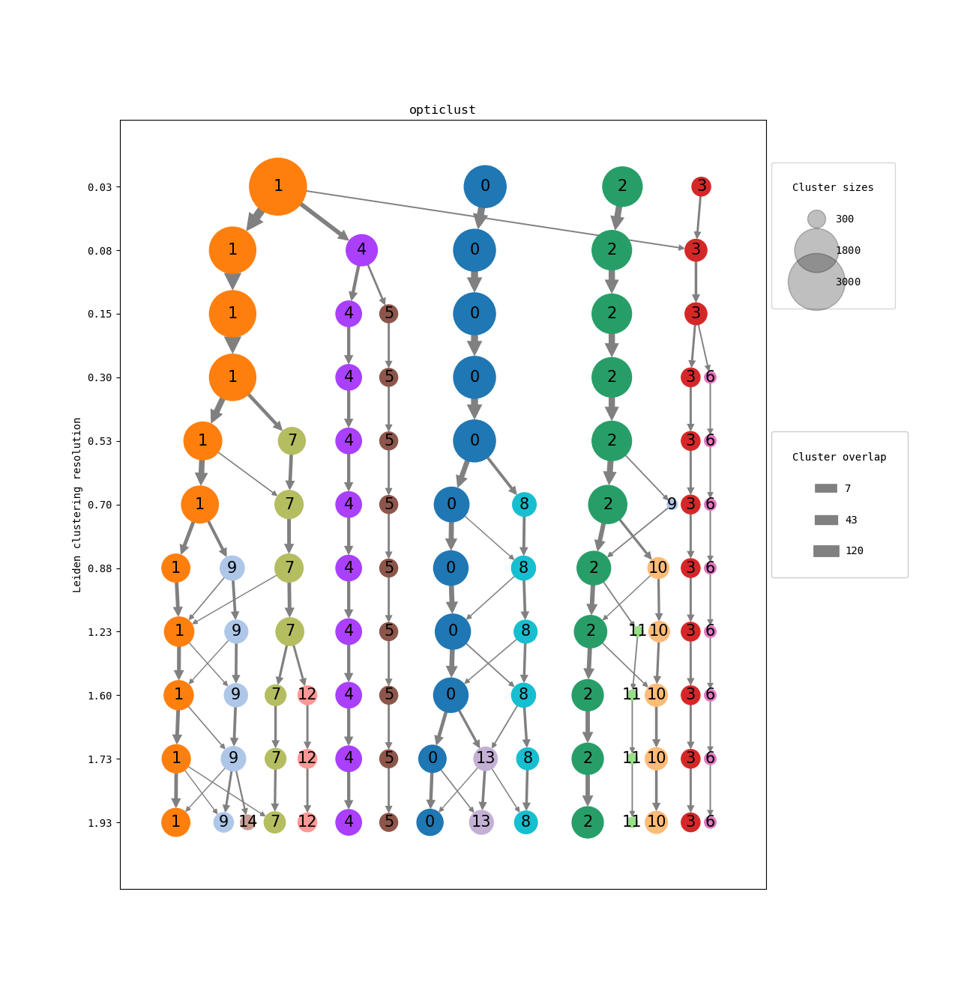
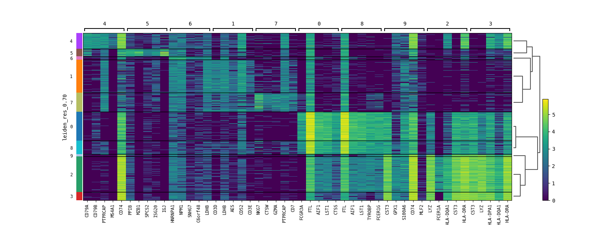
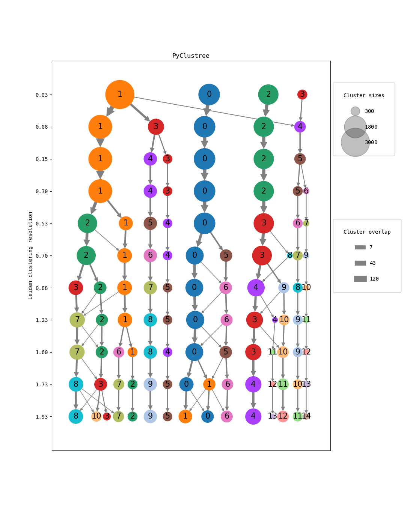

# PyClustree

Single cell clustering at a glance. 
Identify which clustering resolution(s) fit your data within minutes.

PyClustree offers:
  - Automated clustering (leiden/louvain) at various resolutions
  - Automatic selection of significant resolutions
  - Visualization of clusters per resolution and their relative compositions 
  - Easy to use, yet highly customizable Python API
  - Cluster recoloring for PyClustree and UMAP visualization (see below)

# Installation

```sh
git clone https://github.com/siebrenf/pyclustree.git
pip install pyclustree
```

## Dev install

```sh
git clone https://github.com/siebrenf/pyclustree.git
conda env create -n pyclustree -f pyclustree/requirements.yaml
conda activate pyclustree
pip install --editable . --no-deps --ignore-installed
```

# Tutorial output








The UMAPs and cluster tree can be compared immediately due to the automatic renaming and recoloring of the clusters. 
Without renaming and recoloring, figures would have looked like this:

For example, note how cluster 2 becomes cluster 3 at resolution 0.53.




# Acknowledgements

This tool was inspired by:
- The original [Clustree](https://github.com/lazappi/clustree) R package.
- This [BioStars post](https://www.biostars.org/p/9489313/#9489342) by firestar.
