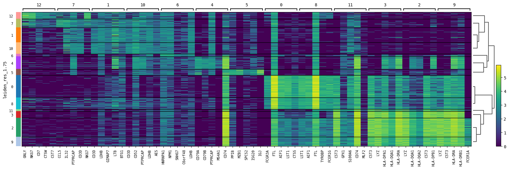

# opticlust

[](https://github.com/siebrenf/opticlust/actions/actions/workflows/ci-cd.yml)
[](https://github.com/astral-sh/ruff)
[](https://badge.fury.io/py/opticlust)
[](http://bioconda.github.io/recipes/opticlust/README.html)
[](https://anaconda.org/bioconda/opticlust)
[](https://anaconda.org/bioconda/opticlust)
[](https://doi.org/10.5281/zenodo.14513541)

Single cell clustering and recommendations at a glance. 
Identify which clustering resolution(s) fit your data within minutes.

Opticlust currently offers:
  - Automated clustering (leiden/louvain) at various resolutions
  - Automatic selection of significant resolutions
  - Clustering recommendations based on intra- and intercluster metrics
  - Visualization of clusters per resolution and their relative compositions 
  - Easy to use, yet highly customizable Python API
  - Cluster recoloring for opticlust and UMAP visualization (see below)


# Installation

## PyPi

```sh
pip install opticlust
```

## Conda

```sh
conda install -c bioconda opticlust
```

## GitHub

```sh
git clone https://github.com/siebrenf/opticlust.git
pip install opticlust
```

## Develop

```sh
git clone https://github.com/siebrenf/opticlust.git
conda env create -n opticlust -f opticlust/requirements.yaml
conda activate opticlust
pip install --editable ./opticlust --no-deps --ignore-installed
```


# Tutorial output

Output of `clustering_plot()` and `score_resolutions()`:


Output of `clustree_plot()`:


Output of `sc.pl.umap()`


Output of `sc.pl.rank_genes_groups_heatmap()` and `sc.pl.rank_genes_groups_dotplot()`:

`top_low` recommended resolution:


`top_medium` recommended resolution:


`top_high` recommended resolution:



# Advantages of opticlust

The UMAPs and cluster tree plot can be compared immediately due to the automatic renaming and recoloring of the clusters. 
Without renaming and recoloring, figures would have looked like this:

Output of `clustree(rename_cluster=False)` and `sc.pl.umap()`:


Note how cluster 2 becomes cluster 3 at resolution 0.50.
This makes it difficult to track how changes in resolution impacted the clustering.


# Acknowledgements

This tool was inspired by:
- The original [Clustree](https://github.com/lazappi/clustree) R package.
- This [BioStars post](https://www.biostars.org/p/9489313/#9489342) by firestar.

# How to cite
When using this software package, please correctly cite the accompanied DOI under "Citation": https://doi.org/10.5281/zenodo.14513541
