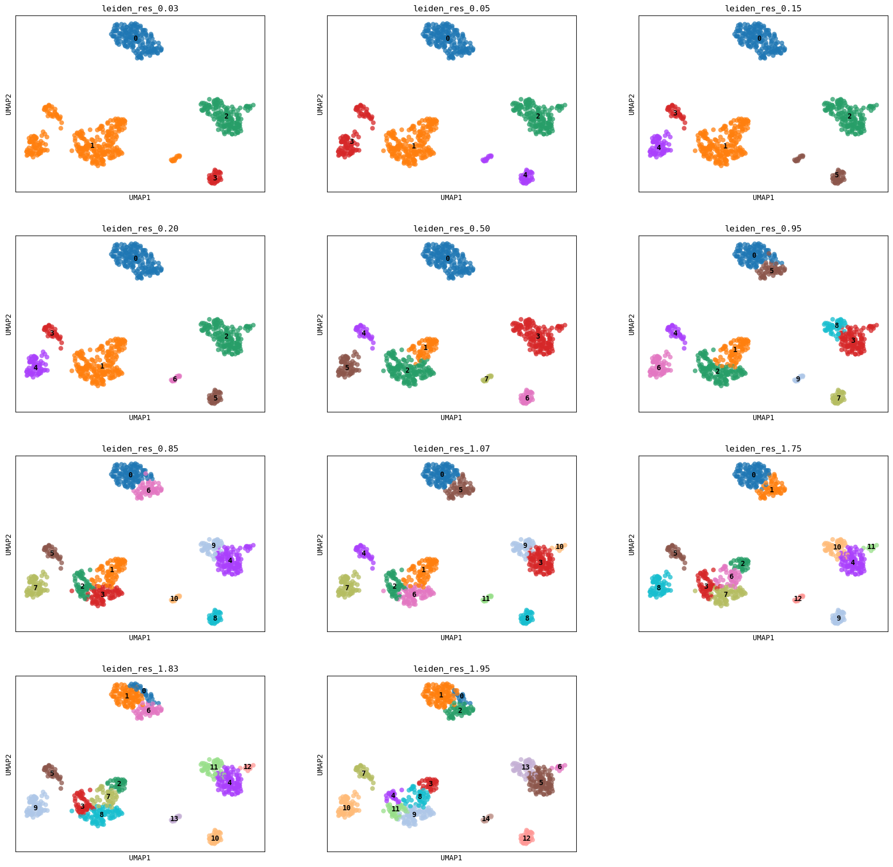

# PyClustree

Visualize single cell clusters at various resolutions.

PyClustree offers:
  - Easy to use, yet highly customizable Python API
  - Quickly identify the clustering resolutions at which your data separates nicely
  - Cluster recoloring for PyClustree and UMAP visualization (see below)

# Tutorial output

The UMAPs and cluster tree can be compared immediately due to the automatic renaming and recoloring of the clusters. 
Without renaming and recoloring, figures would have looked like this:

For example, note how cluster 2 becomes cluster 3 at resolution 0.53.

# Acknowledgements

This tool was inspired by:
- The original [Clustree](https://github.com/lazappi/clustree) R package.
- This [BioStars post](https://www.biostars.org/p/9489313/#9489342) by firestar.
